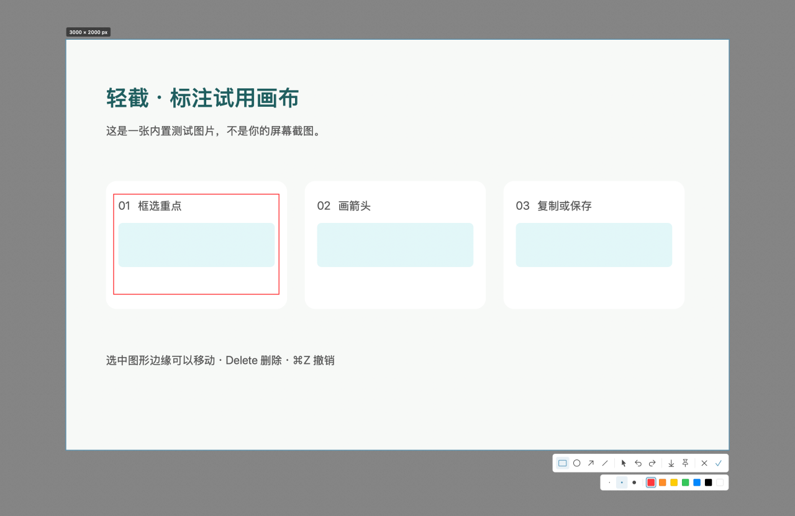
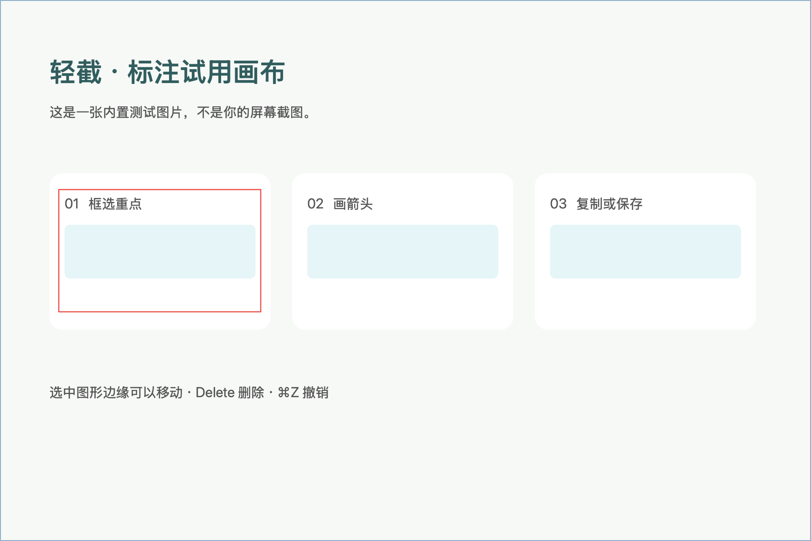

# 轻截 LightSnap

面向 Apple Silicon 的 macOS 原生截图与录屏工具，使用 Swift、AppKit、ScreenCaptureKit 和系统图形框架，无第三方依赖。需要 macOS 14 或更新版本。

当前版本为 **0.1.6 预览版**，录屏背景提供致敬 macOS 系统壁纸的七款渐变配色，也可一键使用当前桌面壁纸，详见[发布说明](docs/releases/v0.1.6.md)。



## 安装与运行

从 [GitHub Releases](https://github.com/JamieFingalden/LightSnap/releases) 下载 `LightSnap-0.1.6-arm64.dmg`，打开后将 `LightSnap.app` 拖入 `Applications` 文件夹。安装包采用临时签名，未经过 Apple 公证；首次打开可能需要在 macOS「隐私与安全性」中确认。

本地安装包位于 `dist/LightSnap-0.1.6-arm64.dmg`，同目录的 `.sha256` 文件可校验安装包。

从源码构建后，也可以直接打开 `dist/LightSnap.app`。启动后从菜单栏进入截图或录屏。首次截图或录屏需要在「系统设置 → 隐私与安全性 → 屏幕与系统音频录制」中允许轻截；如果系统要求，退出后重新打开。

如果已经允许且重启后仍被系统拒绝，请在权限列表中删除旧的「轻截」，重新添加当前 `dist/LightSnap.app`，开启权限后再退出并重新打开。本地默认使用临时签名，重新构建后旧授权可能失效。

| 操作 | 默认快捷键 |
| --- | --- |
| 区域截图 | Control + 1 |
| 长截图／结束长截图 | Control + 2 |
| 打开录屏／结束录屏 | Control + 3 |
| 暂停／继续录屏 | Control + 4 |
| 将当前截图贴到桌面 | Command + T（截图标注时） |
| 缩放贴图 | 滚轮／触控板捏合／Command + 加号、减号（Command + 0 恢复） |
| 完成并复制 | Command + C |
| 保存 PNG／JPEG | Command + S |
| 撤销／重做 | Command + Z／Shift + Command + Z |
| 取消截图或标注 | Escape／右键／触摸板双指辅助点按 |

快捷键和登录启动可以在菜单栏「设置」中修改。菜单栏还提供窗口截图、当前屏幕截图和使用说明。

框选后，选区留在原位置，右下方显示浮动工具栏，默认使用移动工具。拖动选区内空白处调整位置，拖动四边或四角调整大小；调整期间实时预览，已有标注仍对齐原截图内容，撤销与重做记录保留。点击矩形、椭圆、箭头或直线工具后才开始绘制；使用移动工具拖动图形边缘调整标注位置，按 Delete 删除。

截图与标注浮层采用不激活应用的面板，避免截图时主动将原应用切到后台。微信普通窗口消失的现象仍待实机回归验证。

## 录屏

菜单栏「录屏」支持屏幕、窗口和区域。可以选择系统声音、麦克风、摄像头和倒计时；录制时通过浮动控制条或快捷键暂停、继续与结束。

录完直接进入预览，支持自动缩放、平滑与放大鼠标、闲置隐藏、点击动效、快捷键提示、背景与留白、圆角阴影、摄像头位置和独立音量。可切换原始、横屏、竖屏和方形画布，导出最高 4K / 60 fps 的 MP4，或 30 秒以内的 GIF。没有字幕功能和时间轴编辑器。

原片与样式保存在「桌面 / LightSnap」，MP4 与 GIF 默认导出到桌面。关闭预览后仍可从「打开已有录屏」继续调整、导出。录屏功能、权限与验证方法见[录屏说明](docs/recording.md)。

## 智能选区

智能选区从 0.1.1 开始提供。开始截图后，鼠标悬停会自动描边定位窗口或控件，单击确认选区；按住拖动仍可手动框选。普通截图时按空格选择鼠标所在屏幕。选区和标注界面都可按 Esc、右键或触摸板双指辅助点按取消；触摸板需在 macOS 中启用对应的辅助点按手势。

窗口定位无需额外权限。要识别窗口内的按钮、列表和内容区域，在轻截「设置 → 设置元素定位权限」中为当前应用开启 macOS 辅助功能权限；同一权限也用于贴图的触控板捏合缩放。截图时不会弹出辅助功能授权请求；没有权限、目标应用无响应或不提供控件信息时，自动使用窗口范围。

定位会按需请求浏览器和 Electron 应用开放控件树，再沿鼠标命中的容器查找更细的子控件；持续移动鼠标也会更新，快速单击会等待一次最终定位。查询在后台按限定频率和节点数执行，超时保留已有结果。

智能选区也适用于长截图，会跳过过小的控件；仍建议手动避开固定栏和滚动条。不暴露辅助功能信息的自绘界面暂时只能按窗口定位或手动框选。

## 贴图

截图标注时按 Command + T，或点击工具栏的图钉，将当前图片连同标注固定在桌面。可以同时保留多张贴图，拖动图片移动窗口。鼠标滚轮向前推放大、向后拉缩小，触控板双指捏合缩放，也可以用 Command + 加号／减号；缩放以光标位置为中心，窗口和边框随图片一起缩放，最小 10%、最大 500%。触控板和 Magic Mouse 的双指滚动用于查看超出屏幕的长图，按住 Command 滚动则缩放；鼠标按住 Option 滚动可滚动长图。Command + 0 恢复缩放，Command + C 复制贴图。双击贴图，或右键选择「关闭该贴图」即可关闭。

触控板捏合需要在「设置 → 设置元素定位权限」中为轻截开启辅助功能权限。轻截是不激活的菜单栏应用，macOS 只把捏合手势发给前台应用，开启权限后轻截才能把落在贴图上的捏合转发给贴图；轻截不会为此主动弹出授权请求。没有权限时请使用滚轮、Command + 滚动或快捷键，这些不依赖权限。



Command + T 只在截图标注界面生效，不注册为全局快捷键。

## 长截图

框选需要滚动的内容区，避开固定导航栏、悬浮控件和滚动条，然后缓慢向下滚动。再次按截图快捷键或点击完成按钮，即可进入标注和导出。

当前版本支持单个区域的纵向手动滚动。重叠不明确时停止追加并提示回滚，保留已经成功捕获的部分；不保证复杂固定栏、动画、重复列表及快速滚动的拼接效果。

采集期间以低帧率捕获，新增内容按分块写入临时目录；编辑时按可见区域读取，撤销只保存图形数据。单张图片限制为六千万像素。导出仍需要完整图像缓冲区，接近上限时会有明显内存峰值。

## 构建与验证

构建需要 Swift 6 工具链（Xcode 16 或更新版本）。在项目目录执行：

```sh
zsh scripts/build.sh
swift test -c release --disable-sandbox
zsh scripts/check-pin.sh
zsh scripts/check-selection.sh
zsh scripts/check-recording.sh
open dist/LightSnap.app --args --demo
```

构建脚本生成仅含 ARM64 的本地签名应用。`--demo` 打开内置测试图，不需要屏幕录制权限，可用于验证标注、撤销、保存和复制。

若钥匙串中已有代码签名证书，可通过 `LIGHTSNAP_SIGN_IDENTITY` 指定同一个签名身份，以保持更新前后的应用身份稳定；脚本不会创建证书或修改系统授权。

现有七项核心测试覆盖滚动偏移、无重叠与重复内容拒绝、分块合成方向、标注位置、PNG 复制像素一致性、像素上限和临时文件释放。

贴图检查复用实际窗口代码，验证快捷键、滚轮与捏合缩放后边框贴合图片、同一手势不会重复应用、窗口不超出屏幕，以及双击和菜单关闭；运行脚本的终端已有辅助功能权限时，还会在检查进程不在前台的状态下发送合成捏合，验证事件转发到贴图。

选区检查复用实际选区视图与编辑器，验证智能定位、默认移动、边角缩放、拖动预览、屏幕边界、工具栏点击、标注导出与撤销，以及浮层不激活应用的配置；不需要屏幕录制或辅助功能权限。

生成 DMG 安装包及 SHA-256 校验文件：

```sh
zsh scripts/package-dmg.sh
```

输出位于 `dist/`，安装包包含应用、`Applications` 快捷方式、安装说明和许可证。构建缓存和安装包不进入源码仓库，安装包通过 Releases 提供。

## 许可证

[MIT](LICENSE)
